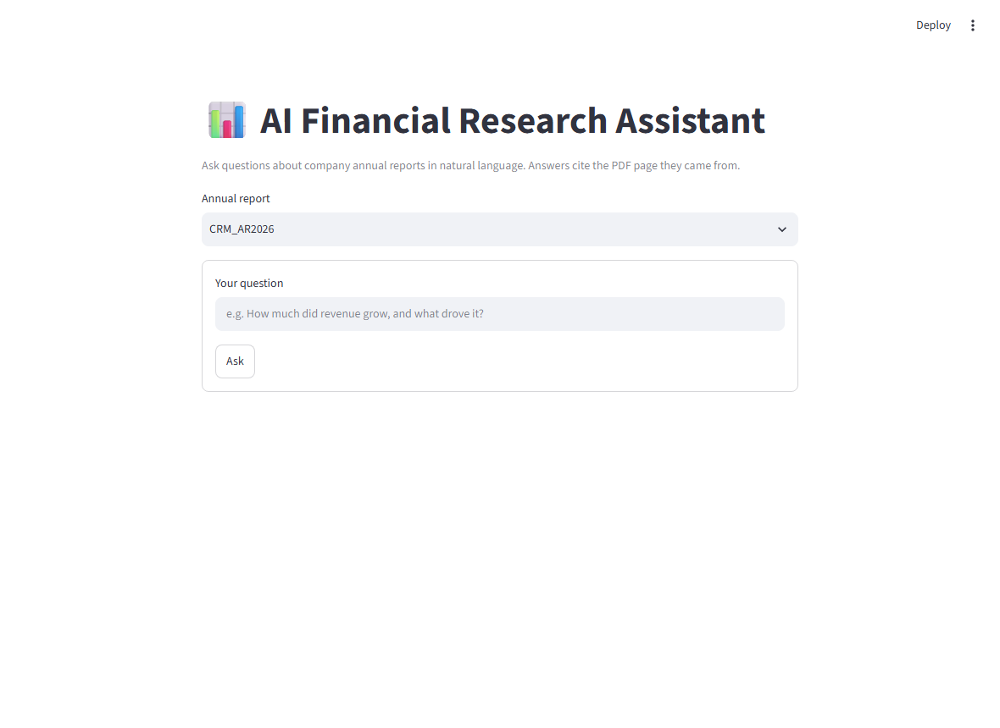
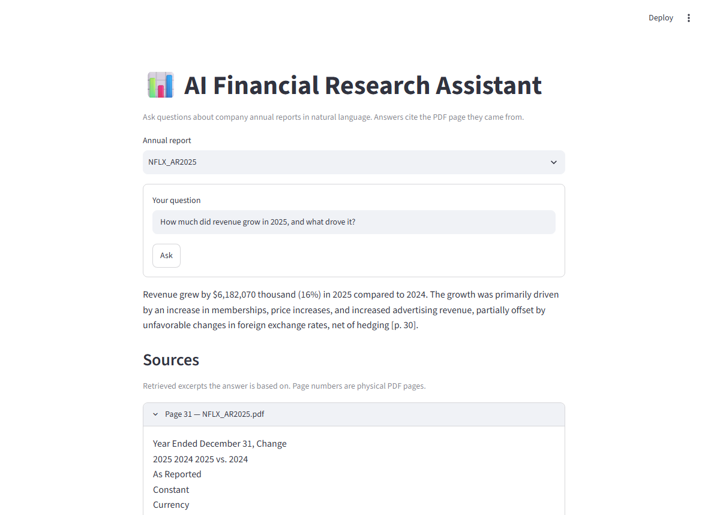
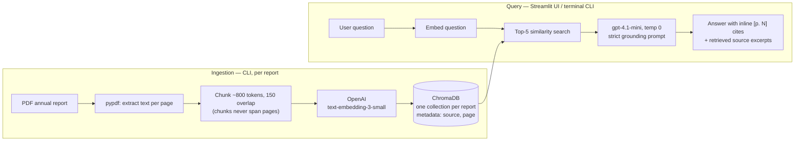

# 📊 AI Financial Research Assistant

Ask questions about company annual reports in natural language and get
answers **with page-level citations**. Retrieval-augmented generation (RAG)
over SEC-filed annual reports: PDF → per-page chunks → OpenAI embeddings →
ChromaDB → top-k retrieval → grounded LLM answer.

**Live demo:** <https://ai-financial-research-assistant-ray.streamlit.app>
(pre-ingested: Netflix FY2025, Salesforce FY2026, Micron FY2025)

| Ask a question | Get a cited answer + sources |
|---|---|
|  |  |

## Architecture



Design choices worth noting:

- **Chunks never span PDF pages**, so every chunk carries an exact page
  number — citations are the product's core promise.
- **The prompt forbids outside knowledge** and requires an inline `[p. N]`
  cite per claim; when retrieval comes up empty the model says "not in the
  report" instead of guessing.
- **The ChromaDB directory is committed to git** — that's how pre-ingested
  reports ship to Streamlit Community Cloud with no vector-DB service.
- Cited page numbers are **physical PDF pages** (the Nth page of the file),
  which may differ from the page number printed in the footer.

## Eval results

20 Q&A pairs across the three reports, gold figures string-verified against
the PDF text. Two metrics per question: did a gold page reach the top-5
retrieved chunks (hit-rate), and an LLM judge (`gpt-4.1`) grading the answer
against the gold answer under a strict rubric. Full details:
[evals/scorecard.md](evals/scorecard.md).

| Metric | Baseline (v1) |
|---|---|
| Retrieval hit-rate @ 5 | **14/20 (70%)** |
| Answers graded CORRECT | 8/20 |
| Answers graded PARTIAL | 9/20 |
| Answers graded INCORRECT | 3/20 |

The honest baseline, unfiltered. Failure patterns (analyzed in
[FUTURE.md](FUTURE.md)): retrieval misses cluster on questions whose answers
live in dense financial-statement tables; most PARTIALs are answers that gave
the right figure without the year-over-year context the gold answer demands;
and when retrieval fails outright, the grounding prompt makes the model
decline visibly rather than hallucinate.

## Run it locally

Prereqs: Python 3.11+, an OpenAI API key.

```powershell
git clone https://github.com/thequietearth/ai-financial-research-assistant.git
cd ai-financial-research-assistant
python -m venv .venv
.venv\Scripts\Activate.ps1          # macOS/Linux: source .venv/bin/activate
pip install -r requirements.txt
copy .env.example .env               # then put your OpenAI API key in .env
streamlit run app.py                 # three reports are pre-ingested — it just works
```

### Ingest a new report (CLI — no UI upload by design)

```powershell
python ingest.py data\reports\COMPANY_AR2025.pdf
```

### Query from the terminal

```powershell
python query.py --list
python query.py NFLX_AR2025 "How much did Netflix spend on content in 2025?"
```

### Run the evals

```powershell
python evals\run_evals.py            # writes evals/scorecard.md, ~$0.15 in API calls
```

## Project structure

```
app.py              Streamlit UI (presentation only)
rag.py              Shared RAG core: retrieval + grounded answer generation
ingest.py           PDF -> chunks -> embeddings -> ChromaDB
query.py            Terminal Q&A client
evals/              questions.json, run_evals.py, scorecard.md
chroma_db/          Persisted vector store (committed - ships with the app)
data/reports/       Source PDFs (gitignored - only embeddings ship)
```

## Deploying your own

Push to GitHub, create the app on [Streamlit Community
Cloud](https://share.streamlit.io) (`main`, `app.py`), and set
`OPENAI_API_KEY` in the app's **Secrets**. Anyone with the app URL runs
queries billed to that key — set a spending cap on the OpenAI dashboard.

## Roadmap

v2 candidates and deliberate v1 simplifications live in
[FUTURE.md](FUTURE.md).

---

*Built as a scoped v1 with a hard contract (see [CLAUDE.md](CLAUDE.md)).
Not investment advice; answers come from the filed reports and can be wrong —
verify against the cited pages.*
