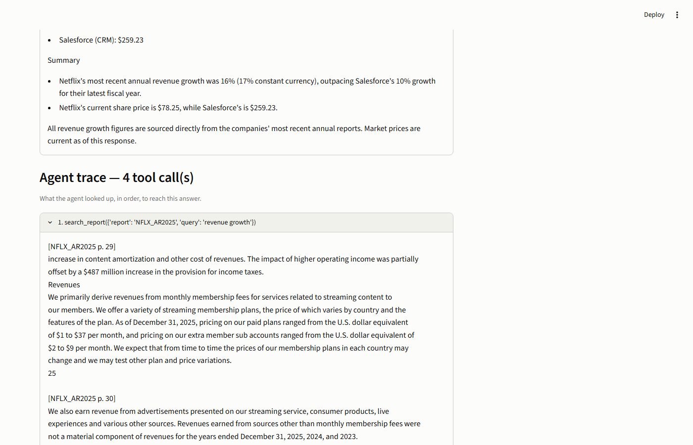
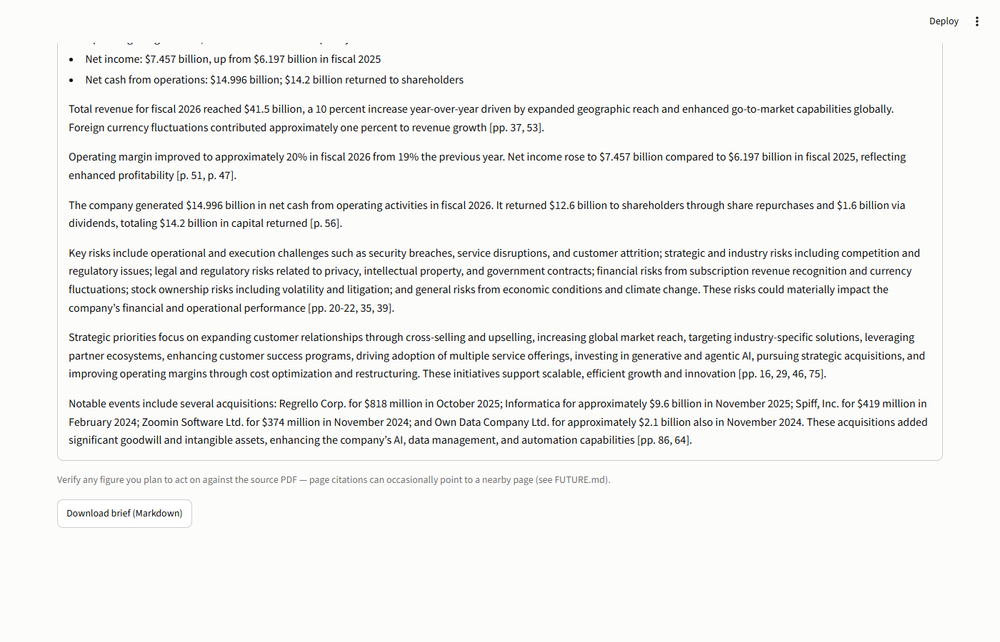
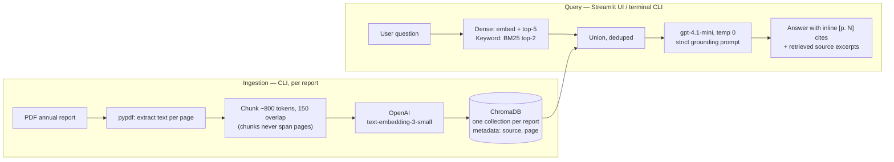

# 📊 AI Financial Research Assistant

A RAG tool for querying company annual reports in natural language. This
project had been scoped before and never shipped — this time the priority
was actually finishing it, so I treated the original scope as a hard
contract (see [CLAUDE.md](CLAUDE.md)) and built it in vertical slices:
ingestion, retrieval, a UI, an eval harness, then polish. Once that v1 was
done and deployed, I kept going — hybrid retrieval, a tool-using agent, and
an executive brief generator, described below.

**Live demo:** <https://ai-financial-research-assistant-ray.streamlit.app>
(pre-ingested: Netflix FY2025, Salesforce FY2026, Micron FY2025)

| Ask a question | Get a cited answer + sources |
|---|---|
|  |  |

| Deep-analysis agent (own tool calls, visible trace) | One-click executive brief |
|---|---|
|  |  |

## How it works

PDF annual report → extract text per page → chunk (~800 tokens, 150
overlap) → embed with OpenAI → store in ChromaDB with page metadata. At
query time it retrieves relevant chunks and asks an LLM to answer using
only what it retrieved, with a page citation on every claim.



A few decisions worth explaining:

- Chunks never span PDF pages. That costs a little recall when an answer
  straddles a page break, but it means every chunk has one unambiguous page
  number, which is the whole point of the citations.
- The prompt is written to refuse outside knowledge and cite every claim.
  If the retrieved excerpts don't answer the question, it says so instead
  of guessing — I'd rather it admit it doesn't know than make something up
  about a company's financials.
- ChromaDB's data directory is committed to git. That's how the
  pre-ingested reports get to Streamlit Community Cloud without standing up
  a separate vector database service.
- Cited pages are physical PDF page numbers (the Nth page of the file),
  which sometimes differ from the page number printed in the document's own
  footer.
- Retrieval is hybrid: dense embedding search unioned with BM25 keyword
  search. I added the keyword side after the eval run below showed dense
  search alone missing questions whose answers live in dense financial
  tables rather than narrative text.

### Agent and executive brief

Two more things sit on top of the same `rag.py` core, for cases a single
retrieval pass doesn't handle well:

- **Deep-analysis agent** (`agent.py`) — a plain function-calling loop
  (`ChatOpenAI.bind_tools()` plus a ~30-line loop, no LangGraph or
  AgentExecutor) with three tools: search a report, get a live stock quote,
  list available reports, capped at 6 calls. Ask it something like *"Is
  Micron's capex sustainable relative to its operating cash flow, and how
  is the market pricing the stock?"* and it decides on its own which
  reports to search and when to pull a live quote, then writes a cited
  answer. The UI shows the full tool-call trace, so you can see what it
  looked up and in what order.
- **Executive brief generator** (`brief.py`) — runs a fixed six-question
  battery (revenue & growth, profitability, cash & capital returns, key
  risks, strategic priorities, notable events) through the normal grounded
  pipeline, then one more call compiles the already-cited answers into a
  one-page brief. Downloadable as Markdown.

Building both of these surfaced two real bugs in the existing code, not
just in the new stuff — a silent-collection-creation footgun in
`rag.get_store()` and an app-wide bug where dollar amounts got rendered as
garbled LaTeX. Both are written up in [FUTURE.md](FUTURE.md).

## Eval results

20 Q&A pairs across the three reports, gold answers checked against the
PDF text directly (not against the pipeline's own output). Two things get
measured per question: whether a gold page showed up in the top-5 retrieved
chunks, and whether an LLM judge (`gpt-4.1`) grades the answer as correct
against a strict rubric. Full breakdown in
[evals/scorecard.md](evals/scorecard.md).

| Metric | Baseline (v1) | After hybrid retrieval + YoY prompt fix |
|---|---|---|
| Retrieval hit-rate @ 5 | 14/20 (70%) | **15/20 (75%)** |
| Answers graded CORRECT | 8/20 | **9/20** |
| Answers graded PARTIAL | 9/20 | 7/20 |
| Answers graded INCORRECT | 3/20 | 4/20 |

I ran the baseline, looked at what was actually failing, picked the two
cheapest fixes (keyword search unioned with dense retrieval, and a prompt
line requiring year-over-year context when it's available), then re-ran
the identical 20 questions. The result is mixed, and I left it that way
rather than cherry-picking: two clean wins from the prompt fix, one
retrieval miss recovered by keyword search, but also one case where the
added context diluted an answer that was already correct. What that
implies about the next lever (something closer to reranking or table-aware
retrieval) is in
[FUTURE.md](FUTURE.md#eval-driven-improvement-loop-branch-v3-portfolio-2026-09-07).

## Run it locally

Prereqs: Python 3.11+, an OpenAI API key.

```powershell
git clone https://github.com/thequietearth/ai-financial-research-assistant.git
cd ai-financial-research-assistant
python -m venv .venv
.venv\Scripts\Activate.ps1          # macOS/Linux: source .venv/bin/activate
pip install -r requirements.txt
copy .env.example .env               # then put your OpenAI API key in .env
streamlit run app.py                 # three reports are pre-ingested — it just works
```

### Ingest a new report (CLI — no UI upload by design)

```powershell
python ingest.py data\reports\COMPANY_AR2025.pdf
```

### Query from the terminal

```powershell
python query.py --list
python query.py NFLX_AR2025 "How much did Netflix spend on content in 2025?"
python query.py NFLX_AR2025,CRM_AR2026 "Compare revenue growth"
python query.py --deep "Is Micron's capex sustainable vs its cash flow, and how is the market pricing it?"
```

### Run the evals

```powershell
python evals\run_evals.py            # writes evals/scorecard.md, ~$0.15 in API calls
```

## Project structure

```
app.py              Streamlit UI (presentation only)
rag.py              Shared RAG core: hybrid retrieval + grounded answer generation
agent.py            Deep-analysis agent: tool-calling loop over rag.py + market.py
brief.py            Executive brief generator (fixed question battery + synthesis)
market.py           Live stock quotes (yfinance, keyless, cached)
ingest.py           PDF -> chunks -> embeddings -> ChromaDB
query.py            Terminal Q&A client (single, multi-report, and --deep)
evals/              questions.json, run_evals.py, scorecard.md
chroma_db/          Persisted vector store (committed - ships with the app)
data/reports/       Source PDFs (gitignored - only embeddings ship)
```

## Deploying your own

Push to GitHub, create the app on [Streamlit Community
Cloud](https://share.streamlit.io) (`main`, `app.py`), and set
`OPENAI_API_KEY` in the app's **Secrets**. Anyone with the app URL runs
queries billed to that key, so set a spending cap on the OpenAI dashboard.

## What's next

v2 ideas and the simple-vs-clever calls I made along the way are tracked in
[FUTURE.md](FUTURE.md), including three things I've deliberately parked
rather than built — with the reasoning for why.

---

*Not investment advice — answers come from the filed reports and can be
wrong. Verify anything you plan to act on against the cited pages.*
