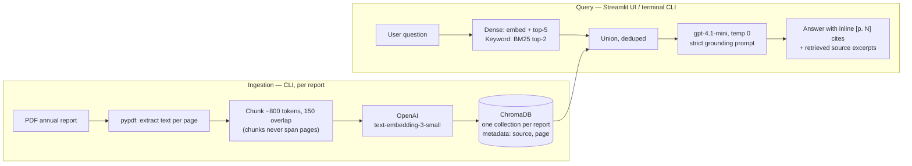

# 📊 AI Financial Research Assistant

Ask questions about company annual reports in natural language and get
answers **with page-level citations**. Retrieval-augmented generation (RAG)
over SEC-filed annual reports: PDF → per-page chunks → OpenAI embeddings →
ChromaDB → hybrid retrieval → grounded LLM answer. Beyond single-shot
retrieval, it also has a tool-using **agent** for multi-step questions and a
one-click **executive brief** generator.

**Live demo:** <https://ai-financial-research-assistant-ray.streamlit.app>
(pre-ingested: Netflix FY2025, Salesforce FY2026, Micron FY2025)

| Ask a question | Get a cited answer + sources |
|---|---|
|  |  |

| Deep-analysis agent (own tool calls, visible trace) | One-click executive brief |
|---|---|
|  |  |

## Architecture



Design choices worth noting:

- **Chunks never span PDF pages**, so every chunk carries an exact page
  number — citations are the product's core promise.
- **The prompt forbids outside knowledge** and requires an inline `[p. N]`
  cite per claim; when retrieval comes up empty the model says "not in the
  report" instead of guessing.
- **The ChromaDB directory is committed to git** — that's how pre-ingested
  reports ship to Streamlit Community Cloud with no vector-DB service.
- Cited page numbers are **physical PDF pages** (the Nth page of the file),
  which may differ from the page number printed in the footer.
- **Retrieval is hybrid**: dense embedding search unioned with BM25 keyword
  search, because they miss on different question shapes (measured in the
  eval loop below).

### Beyond single-shot retrieval: agent and executive brief

Two features sit on top of the same `rag.py` core, for questions a single
retrieval pass doesn't answer well:

- **Deep-analysis agent** (`agent.py`) — a plain function-calling loop
  (`ChatOpenAI.bind_tools()` plus a ~30-line manual loop; no LangGraph, no
  AgentExecutor) with three tools: search a report, get a live stock quote,
  list available reports. Capped at 6 tool calls. For a question like *"Is
  Micron's capex sustainable relative to its operating cash flow, and how is
  the market pricing the stock?"*, it decides on its own which reports to
  search and when to check a live quote, then synthesizes a cited answer.
  The UI renders the full tool-call trace so you can watch what it decided
  to look up, in order.
- **Executive brief generator** (`brief.py`) — runs a fixed six-question
  battery through the standard grounded pipeline (revenue & growth,
  profitability, cash & capital returns, key risks, strategic priorities,
  notable events), then one synthesis call compiles the already-cited
  answers into a one-page brief with headline metrics up top — the artifact
  you'd hand a VP after a discovery call, not a chat transcript. Downloadable
  as Markdown.

Building and testing both surfaced two real bugs in the underlying system,
not just in the new code — a silent-collection-creation footgun in
`rag.get_store()` and an app-wide dollar-sign rendering bug — both root-caused
and fixed; details in [FUTURE.md](FUTURE.md).

## Eval results

20 Q&A pairs across the three reports, gold figures string-verified against
the PDF text. Two metrics per question: did a gold page reach the top-5
retrieved chunks (hit-rate), and an LLM judge (`gpt-4.1`) grading the answer
against the gold answer under a strict rubric. Full details:
[evals/scorecard.md](evals/scorecard.md).

| Metric | Baseline (v1) | After hybrid retrieval + YoY prompt fix |
|---|---|---|
| Retrieval hit-rate @ 5 | 14/20 (70%) | **15/20 (75%)** |
| Answers graded CORRECT | 8/20 | **9/20** |
| Answers graded PARTIAL | 9/20 | 7/20 |
| Answers graded INCORRECT | 3/20 | 4/20 |

This is a real improvement loop, not a demo number: baseline → diagnose
failure patterns → apply the two cheapest levers (BM25 keyword search unioned
with dense retrieval; a prompt line requiring year-over-year context when
available) → re-run the identical 20 questions and publish what actually
moved. It's a modest, mixed result, on purpose reported as such — two clean
wins from the prompt fix, one retrieval miss recovered by keyword search, and
one case where the added context measurably diluted an otherwise-correct
answer. The full question-by-question breakdown, including *why* four misses
didn't move and what that implies about the next lever (reranking over table
matching), is in [FUTURE.md](FUTURE.md#eval-driven-improvement-loop-branch-v3-portfolio-2026-09-07).

## Run it locally

Prereqs: Python 3.11+, an OpenAI API key.

```powershell
git clone https://github.com/thequietearth/ai-financial-research-assistant.git
cd ai-financial-research-assistant
python -m venv .venv
.venv\Scripts\Activate.ps1          # macOS/Linux: source .venv/bin/activate
pip install -r requirements.txt
copy .env.example .env               # then put your OpenAI API key in .env
streamlit run app.py                 # three reports are pre-ingested — it just works
```

### Ingest a new report (CLI — no UI upload by design)

```powershell
python ingest.py data\reports\COMPANY_AR2025.pdf
```

### Query from the terminal

```powershell
python query.py --list
python query.py NFLX_AR2025 "How much did Netflix spend on content in 2025?"
python query.py NFLX_AR2025,CRM_AR2026 "Compare revenue growth"
python query.py --deep "Is Micron's capex sustainable vs its cash flow, and how is the market pricing it?"
```

### Run the evals

```powershell
python evals\run_evals.py            # writes evals/scorecard.md, ~$0.15 in API calls
```

## Project structure

```
app.py              Streamlit UI (presentation only)
rag.py              Shared RAG core: hybrid retrieval + grounded answer generation
agent.py            Deep-analysis agent: tool-calling loop over rag.py + market.py
brief.py            Executive brief generator (fixed question battery + synthesis)
market.py           Live stock quotes (yfinance, keyless, cached)
ingest.py           PDF -> chunks -> embeddings -> ChromaDB
query.py            Terminal Q&A client (single, multi-report, and --deep)
evals/              questions.json, run_evals.py, scorecard.md
chroma_db/          Persisted vector store (committed - ships with the app)
data/reports/       Source PDFs (gitignored - only embeddings ship)
```

## Deploying your own

Push to GitHub, create the app on [Streamlit Community
Cloud](https://share.streamlit.io) (`main`, `app.py`), and set
`OPENAI_API_KEY` in the app's **Secrets**. Anyone with the app URL runs
queries billed to that key — set a spending cap on the OpenAI dashboard.

## Roadmap

v2 candidates and deliberate v1 simplifications live in
[FUTURE.md](FUTURE.md).

---

*Built as a scoped v1 with a hard contract (see [CLAUDE.md](CLAUDE.md)).
Not investment advice; answers come from the filed reports and can be wrong —
verify against the cited pages.*
